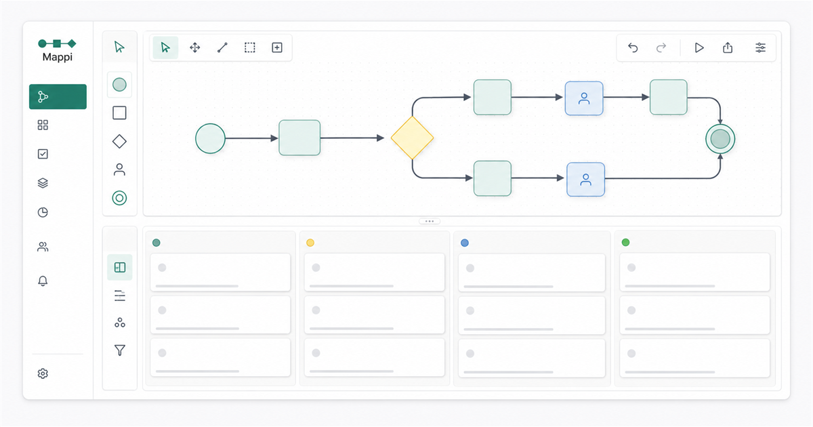

# Mappi



**Visual workflows that create work.** Mappi turns process maps into executable tasks, decisions, approvals, and deadlines — without duplicating information between a board and a calendar.

This repository is an independent portfolio case study. Its full-screen interface recreates the product experience with synthetic data; it does not contain production source code, operational data, credentials, or commercial integrations.

## Try the central journey

1. Open **Maps** and create a new process.
2. Add tasks, decisions, approvals, or interconnections on the spatial canvas.
3. Connect the steps, publish the map, and start a run.
4. Open **Tasks**, complete the checklist, and send the current step for review.
5. Approve or choose a decision path and watch Mappi create the next task automatically.
6. Open **Calendar** to see the same work organized by deadline.

You can also reorder maps in the grid, move tasks across the board, start a task directly from any published map, and explore simulated app connections.

All demo state stays in the browser's local storage. External apps are visual simulations only and never connect to real accounts.

## Run locally

```bash
npm install
npm run dev
```

Open `http://localhost:3000`.

Available validation commands:

```bash
npm run check:demo
npm run check:showcase
npm run lint
npm run build
```

## Product model

```text
Map → published snapshot → run → current task → review → next task
                                         └──────────────→ calendar
```

- **Maps** hold the spatial logic of a process.
- **Tasks** are the executable units generated by each step.
- **Calendar** is a time-based projection of those same tasks.
- **Apps** bring capabilities closer to the point in the process where they help.

Read more in [Architecture](./docs/ARCHITECTURE.md) and [Modules](./docs/MODULES.md).

## Public boundary

Mappi and this demonstration are proprietary. Publishing this repository for evaluation does not grant permission to use, copy, modify, distribute, host, sublicense, or commercially exploit the material. See [NOTICE.md](./NOTICE.md) and [SECURITY.md](./SECURITY.md).
